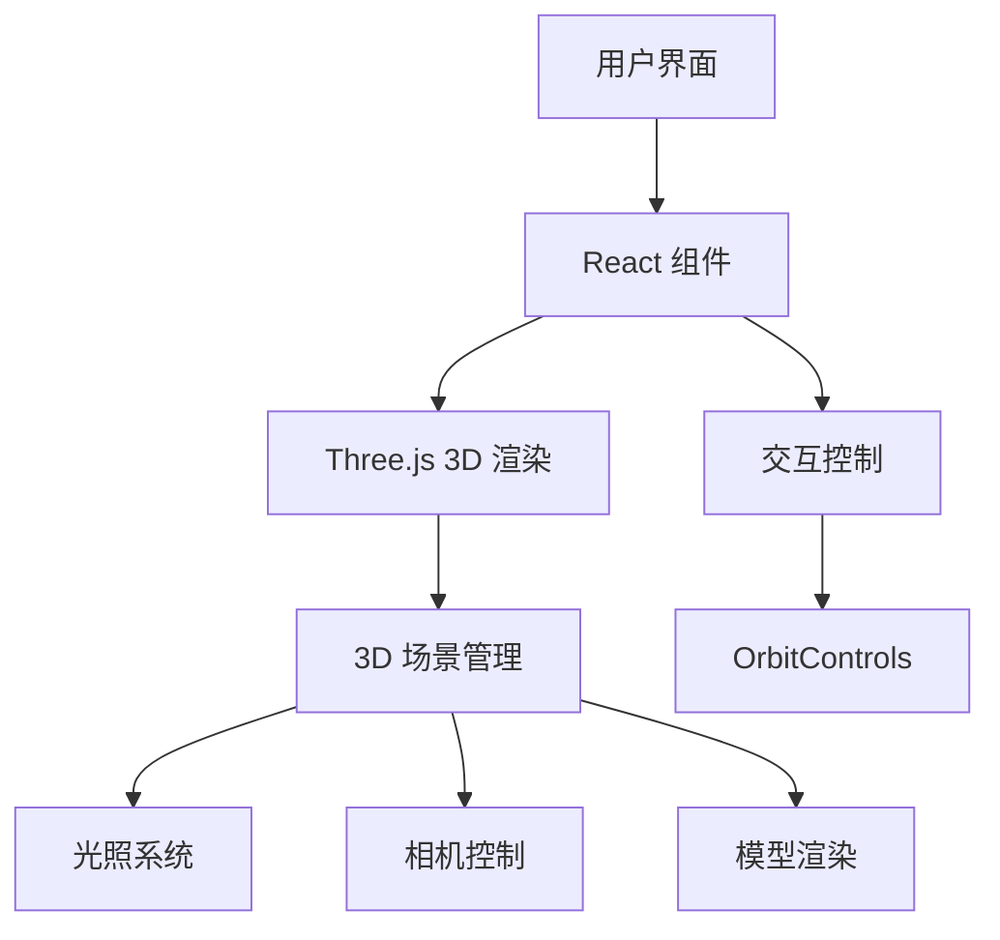

## 1. Architecture Design


## 2. Technology Description
- 前端：React@18 + TypeScript + tailwindcss@3 + vite
- 初始化工具：vite-init
- 3D 库：three.js + @react-three/fiber + @react-three/drei + @react-three/postprocessing
- 状态管理：zustand
- 后端：无

## 3. Route Definitions
| Route | Purpose |
|-------|---------|
| / | 3D 零件展示主页 |

## 4. 3D 组件结构
```
src/
├── components/
│   ├── Scene3D.tsx          # 3D 场景组件
│   ├── ValveModel.tsx       # 阀门模型组件
│   ├── Controls.tsx         # 控制面板组件
│   └── Lighting.tsx         # 光照组件
├── App.tsx                  # 主应用组件
└── main.tsx                 # 应用入口
```

## 5. 核心技术要点
1. **3D 模型构建**：使用 Three.js 基础几何体组合构建阀门模型
2. **光照系统**：多光源配置实现金属质感
3. **交互控制**：OrbitControls 实现旋转、缩放、平移
4. **动画效果**：模型自动旋转和用户交互动画
5. **视觉增强**：后期处理效果提升视觉体验
